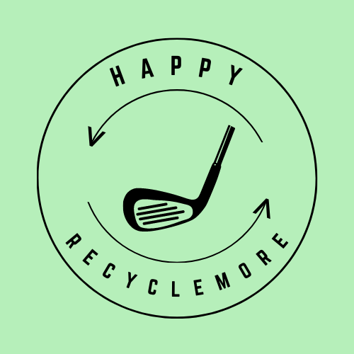

# Happy Recyclemore

TLDR: Happy Recyclingmore is a recycling bin lid that uses ML/AI, microcontrollers and sensors to identify various waste materials. If the material classyfies as recycleable, the lid will let it drop into the bin, otherwise it will "yeet" it.  

<h2>Background</h2>

This project was made during Delta Hacks to reduce recycling contamination. Contamination can damage perfectly recyclable materials preventing reprocessing and ultimatly turns it into landfill material. 

<h2>How It Works</h2>

The lid senses when an item is placed on the platfrom and takes a photo using a webcam. The image is processed and sent to a Tensorflow model which identifies the material as recycleable or not. A signal is then sent to to the Aurduino which will either launch or drop the item.  

<h2>System Requirements</h2>

To recreate this project you will need the following hardware:
- Arduino
- Servo
- Ultrasonic Sensor
- A Windows or Linux computer with USB-A or USB-C connectivity
- Webcam

To recreate this project you will need the following software:
- Python 3.8 or newer
- C++
- TensorFlow
- Tensorflow Object Detection API
- Jupyter Notesbooks
- Google Colab

<h2>Next Steps</h2>

Currently the model tries to predict everything in the picture which leads to inaccuracies since it detects things in the backgrounds like people's clothes which aren't recyclable causing it to yeet the object when it should drop it. To fix this we'd like to only use the object in the centre of the image in the prediction model or reorient the camera to not be able to see anything else.

<h2>Things We Used</h2>

Created by: [Shaan Suthar](https://www.linkedin.com/in/shaan-suthar/), [Richard Li](https://www.linkedin.com/in/richardli2003/), [Matthew Mark](https://www.linkedin.com/in/matthew-mark-/), and [Jemima Vijayasenan](https://www.linkedin.com/in/jemimav/)
